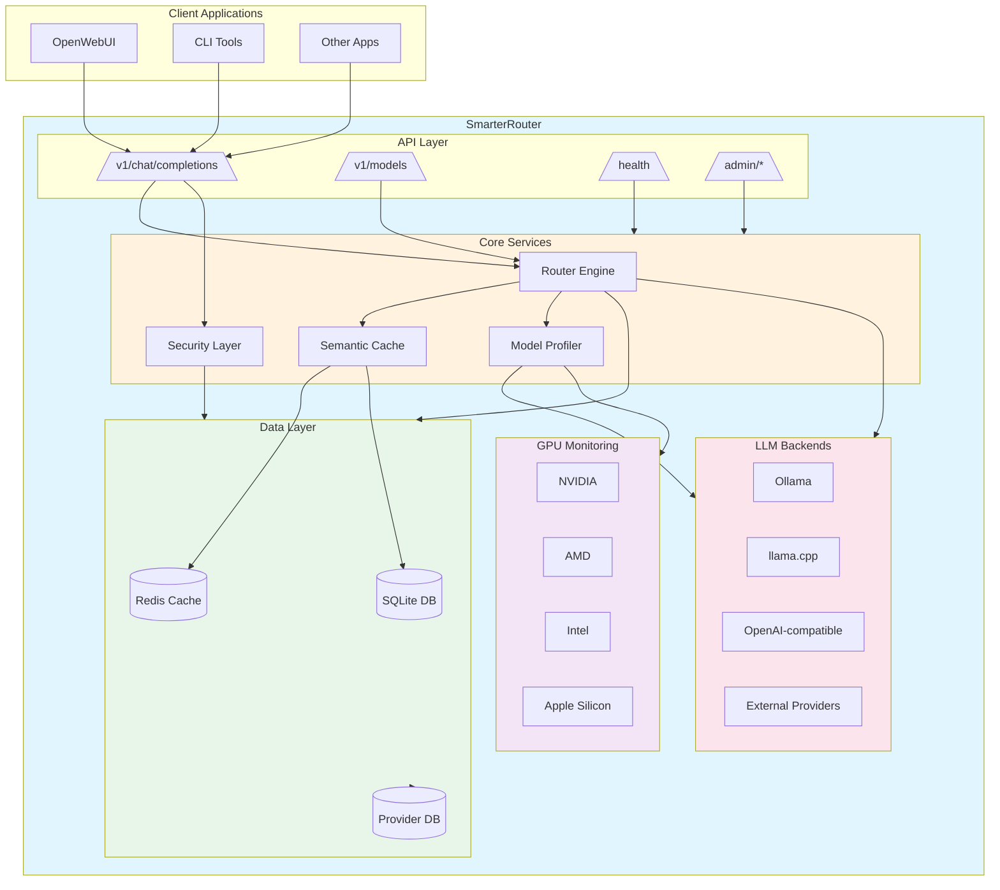
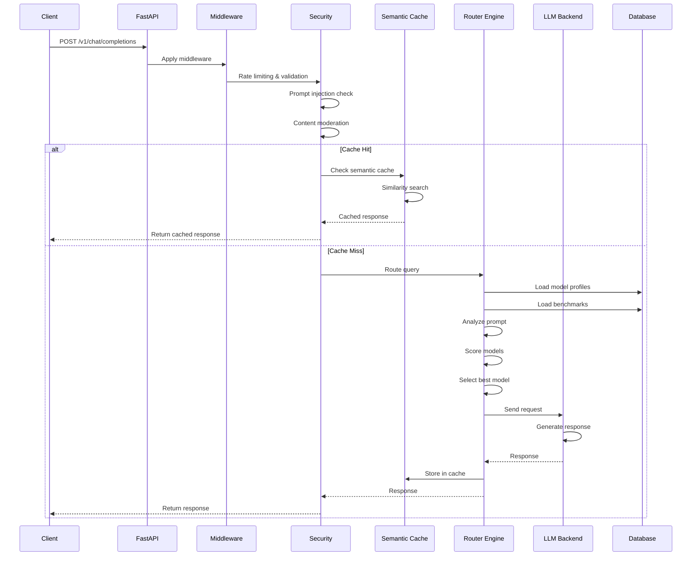
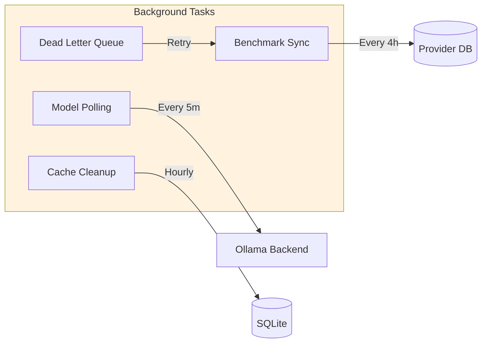
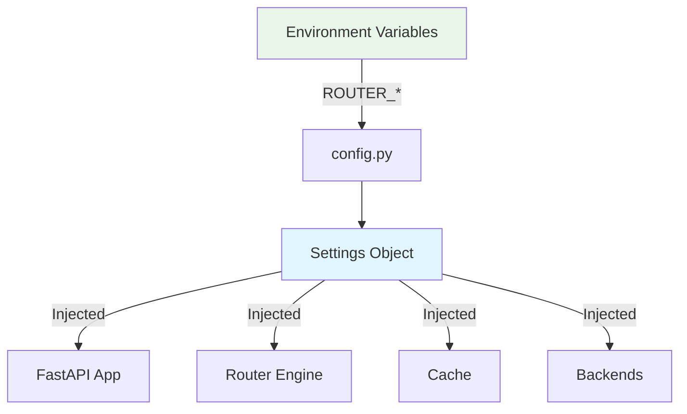
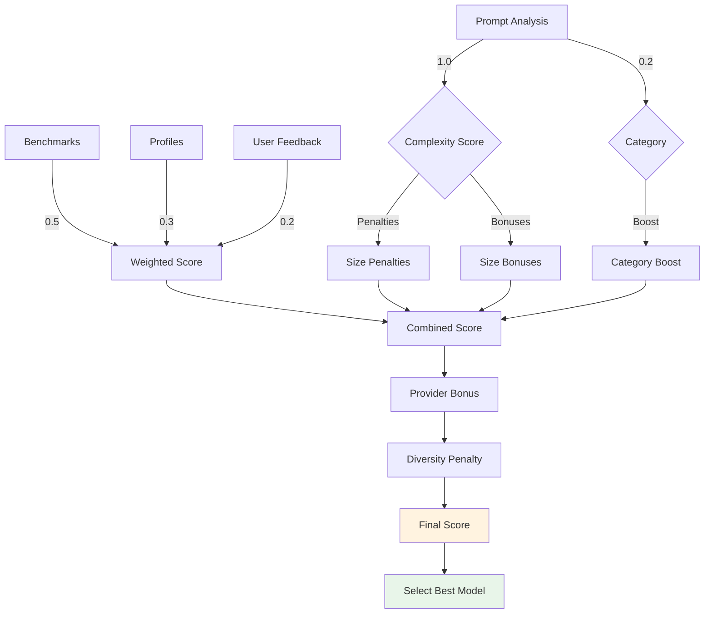
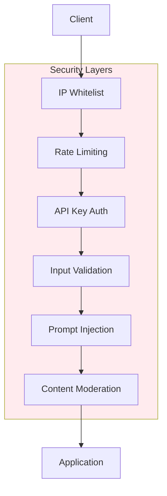
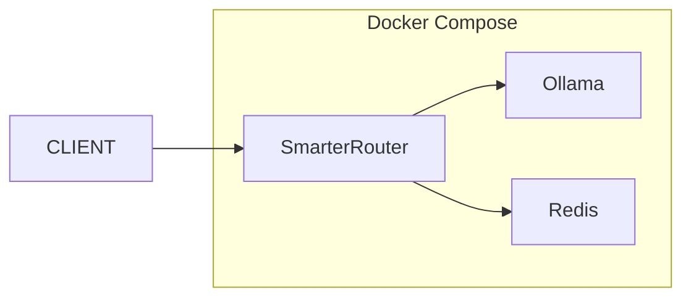
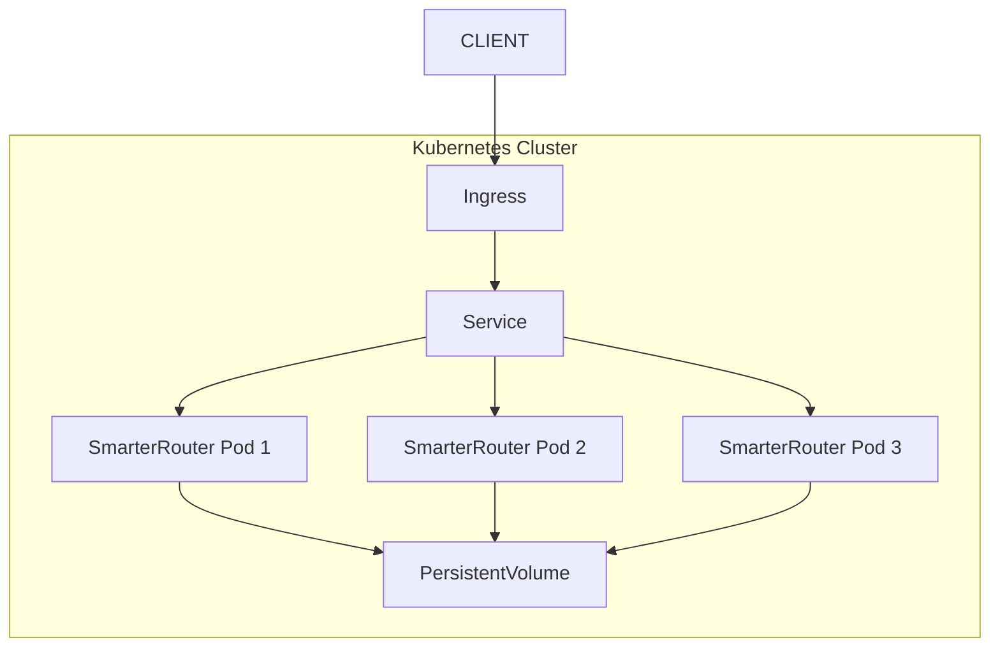

# Architecture Overview

This document describes the SmarterRouter architecture and data flow.

## System Architecture



## Request Flow



## Component Breakdown

### 1. API Layer

- **REST API**: FastAPI-based endpoints
- **OpenAI Compatibility**: Drop-in replacement for OpenAI API
- **Admin Endpoints**: Management and monitoring

### 2. Core Services

#### Router Engine

- Analyzes prompts for complexity, tools, vision requirements
- Scores models using benchmarks + profiles + feedback
- Applies penalties/bonuses for size, provider, diversity
- Selects optimal model for each request

#### Model Profiler

- Profiles models using test prompts
- Measures capabilities across categories (reasoning, coding, creativity)
- Estimates VRAM requirements
- Updates database with results

#### Semantic Cache

- Caches routing decisions and responses
- Uses cosine similarity for cache hits
- Adaptive thresholds based on hit rates
- Persistent storage with SQLite

#### Security Layer

- Rate limiting (per IP, per endpoint)
- Prompt injection detection
- Content moderation
- API key validation
- Admin IP whitelist

### 3. Data Layer

- **SQLite**: Primary database for profiles, benchmarks, feedback
- **Redis**: Optional distributed cache
- **Provider DB**: External benchmark data from HuggingFace, LMSYS, ArtificialAnalysis

### 4. LLM Backends

Abstracted interface supporting:
- **Ollama**: Local model management
- **llama.cpp**: High-performance inference
- **OpenAI-compatible**: Any OpenAI API-compatible service
- **External Providers**: OpenAI, Anthropic, Google, etc.

### 5. GPU Monitoring

Auto-detects GPU vendor and monitors:
- **NVIDIA**: nvidia-smi
- **AMD**: rocm-smi + sysfs
- **Intel**: sysfs (i915/xe drivers)
- **Apple Silicon**: unified memory

## Data Flow Detail

### Chat Completion Request

1. **Request Validation**
   - Parse JSON body
   - Validate model name (if specified)
   - Check rate limits

2. **Security Checks**
   - Prompt injection detection
   - Content moderation (optional)
   - Request size validation

3. **Caching**
   - Check semantic cache for similar prompts
   - Cache hit: return cached response
   - Cache miss: continue to routing

4. **Prompt Analysis**
   - Tokenize and analyze complexity
   - Detect vision requirements (images)
   - Detect tool requirements (functions)
   - Calculate complexity score

5. **Model Selection**
   - Load available models
   - Get benchmarks for each model
   - Get user feedback scores
   - Calculate combined scores
   - Apply penalties/bonuses
   - Select best model

6. **Backend Request**
   - Prepare request for selected backend
   - Apply circuit breaker / retry logic
   - Stream response back to client

7. **Post-Processing**
   - Append model signature (if enabled)
   - Cache response
   - Log routing decision

### Background Tasks



## Configuration Flow



## Scoring Algorithm



## Scalability Considerations

### Horizontal Scaling

- Stateless design enables multiple instances
- Redis backend for distributed caching
- Database connection pooling
- Load balancer distributes requests

### Performance Optimizations

- Async/await throughout
- Connection pooling for HTTP clients
- Batched database operations
- Vectorized similarity calculations (numpy)
- LRU caching for profiles and benchmarks

### Resource Management

- Automatic VRAM monitoring
- Circuit breakers prevent cascading failures
- Rate limiting protects resources
- Background tasks don't block requests

## Security Architecture



## Deployment Options

### Docker Compose (Single Node)



### Kubernetes (Production)



See [kubernetes.md](kubernetes.md) for detailed Kubernetes deployment instructions.

## Monitoring & Observability

### Metrics

- Request rate, latency, errors (RED metrics)
- Cache hit/miss rates
- GPU VRAM utilization
- Model selection distribution
- Backend health status

### Logging

- Structured JSON logging
- Request correlation IDs
- Sanitized user input
- Error context enrichment

### Health Checks

```
GET /health
```

Returns:
- Database connectivity
- Backend status
- GPU status
- Cache status
- Background task counts
- DLQ counts (if enabled)
